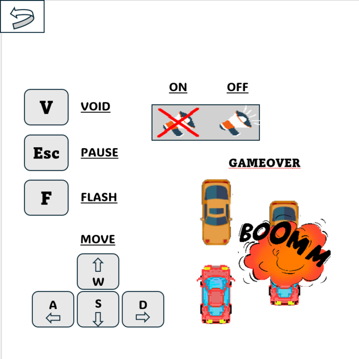

# Racing Car - Game 2D Top-down (SDL2 - Windows)
 
Một game 2D top-down nơi bạn điều khiển một chiếc ô tô trên 8 làn đường, tránh xe cộ để lấy điểm . Game được viết bằng **SDL2** và chạy tốt trên **Windows**. Khi một xe vật cản chạy ra ngoài màn hình sẽ được cộng một điểm.

## Tính năng chính
- Animation
- Texture
- Background
- Event bàn phím
- Event chuột
- Xử lí va chạm
- Tính điểm
- Lưu điểm cao nhất 
- Sound
- Font
- Menu
- Sound on off
- Pause/Resume
- Startus bar / lives
- buff effect
- Background music

## Hình ảnh minh họa

## Một số cơ chế và cách hoạt động
### Xử lí va chạm (dùng SDL hỗ trợ sẵn SDL_HasIntersection )
#### Nguyên lí
- Dựa trên tọa độ hình chữ nhật (SDL_Rect) của hai vật thể, ta xét xem các góc hoặc cạnh của chúng có nằm trong vùng của nhau không.
#### Cách hoạt động
- Tính 4 cạnh của mỗi vật thể (left, right, top, bottom).
- Kiểm tra xem cạnh của object1 nằm trong vùng của object2, và ngược lại.
- Nếu có bất kỳ góc nào của hình này nằm trong hình kia → va chạm xảy ra.

- Tình huống kiểm tra:
  + Nếu một hình nằm hoàn toàn bên trái, bên phải, bên trên, hoặc bên dưới hình kia thì không giao nhau.
  + Nếu không rơi vào các trường hợp đó thì hai hình giao nhau.
 
 ### Hệ thống bản đồ(Bachground) và vật cản(obstacle)  
 ## - Bản đồ
  - Game sử dụng một ảnh nền duy nhất (map1.png) làm đường đi.
  - Bản đồ cuộn dọc vô hạn (dùng scroll()).
 ## - Vật cản 
  - Tải các texture vật cản vào mảng obstacleTextures [ 4 ].
  - Các vật cản sinh ra ngẫu nhiên ở các làn đường cố định.
  - Khi đi khỏi màn hình, obstacle được tái sử dụng thay vì tạo mới.

#### Tự đánh giá mức điểm: 8 - 9
## Các nguồn tham khảo
- Tài liệu lập trình nâng cao.
- Một số website:
 - https://phattrienphanmem123az.com/
 - https://lazyfoo.net/tutorials/SDL/
- Một số website âm thanh hình ảnh: pixabay.com,vnvoice.ne,textcraft.net ...
- Trong quá trình làm game, em có gặp một số bug khó và lỗi ,do chưa có kinh nghiệm trong việc debug nên có sử dụng AI hỗ trợ như Chatgbt , Deepseek , Genmini.
